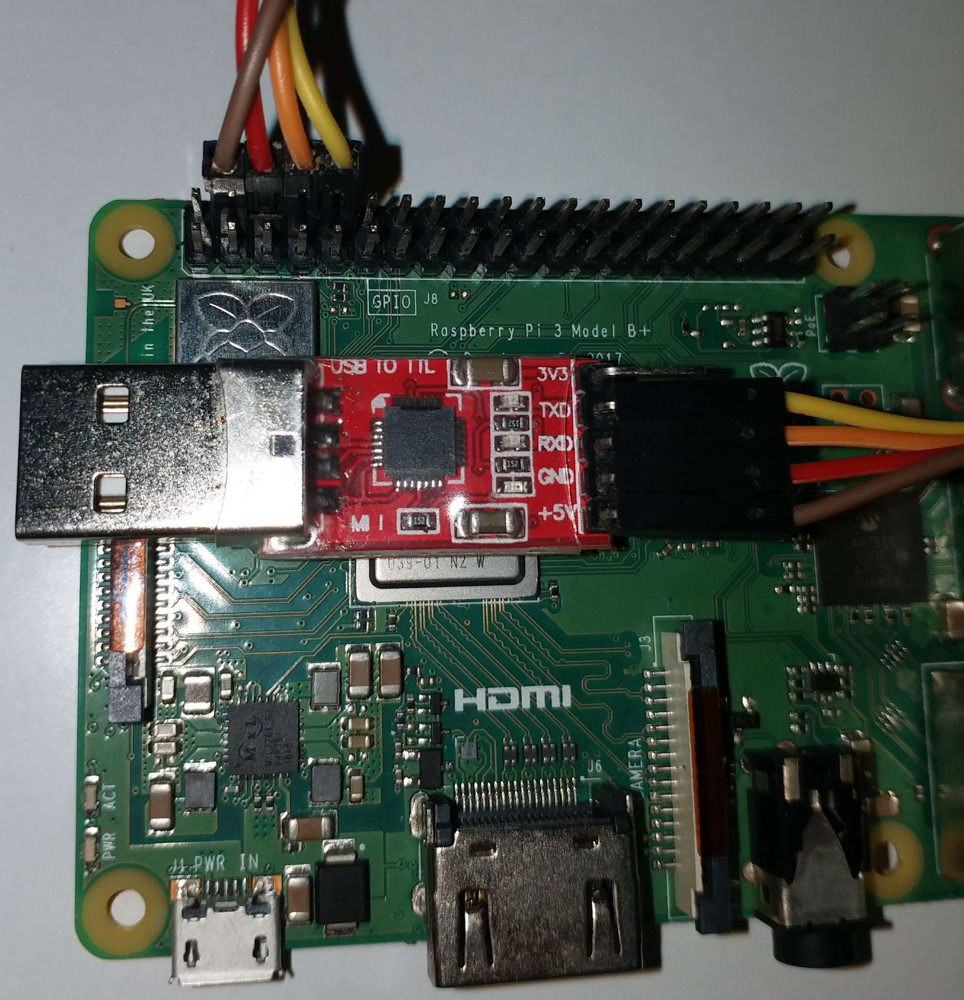

# Operating Systems Capstone 2022 - Lab0 Environment Setup

|||
|:-:|:-:|
|Name|陳沐融|
|ID|310551063|
|GitHub|PersonalWorkingSpace|
|Email|TonyCHEN3000Tony@gmail.com|
|||

## Goal
* Set up the development environment.
* Understand what’s cross-platform development.
* Test your raspi3b.

---

## Install
1. Install a cross compiler:
    ```shell
    sudo apt-get install gcc-aarch64-linux-gnu
    ```

2. Install QEMU emulator of rpi3:\
    For Ubuntu 20.04 or higher version:
    ```shell
    sudo apt-get install qemu
    ```

    For lower version, we need to build from source, please follow the [official website](https://www.qemu.org/download/#source).

## Cross-platform development
1. From source code (a.s) to object files (a.o):\
    The function of a.s is just a while loop.
    ```shell
    aarch64-linux-gnu-gcc -c a.S
    ```
2. From Object files (a.o) to ELF (kernel8.elf):\
    We use our own linker script (linker.ld), the function is to copy the text section from a.o. The default linker script can be saw by `ld --verbose`.
    ```shell
    aarch64-linux-gnu-ld -T linker.ld -o kernel8.elf a.o
    ```

3. From ELF (kernel.elf) to kernel image (kernel8.img):\
    Rpi3’s bootloader can’t load ELF files. Hence, we need to convert the ELF file to a raw binary image.
    ```shell
    aarch64-linux-gnu-objcopy -O binary kernel8.elf kernel8.img
    ```

4. Check on QEMU:
    ```shell
    qemu-system-aarch64 -M raspi3b -kernel kernel8.img -display none -d in_asm
    ```
    * -M raspi3b: the device name may be different, please check the device list by `qemu-system-aarch64 -M help`.\
    * -d in_asm:  show target assembly code for each compiled TB.

5. Debug on QEMU:\
    Run QEMU under debug mode:
    ```shell
    qemu-system-aarch64 -M raspi3 -kernel kernel8.img -display none -S -s&
    ```
    * -S: freeze CPU at startup\
    * -s: shorthand for -gdb tcp::1234\

    Then run cross-platform qdb:\
    ```shell
    gdb-multiarch
    file kernel8.elf
    target remote :1234
    ```

## Test raspi3
1. Download prepared [bootable image](https://github.com/GrassLab/osdi/raw/master/supplement/nctuos.img), the function is to echo the pressed key through UART.

2. Flash it to SD card:
    ```shell
    dd if=nctuos.img of="/sd card device/" # check device by lsblk
    ```
    For Windows, we can use the tool like _Rufus_ to flash image.

3. Connect the raspi3 and computer through UART:\
    **TX/RX on adapter should be plugged to RX/TX on raspi3.**\
    **From 2 to 5 pin on raspi3 are 5V, GND, TX, RX. BTW, 1 pin is 5V too.**

    

4. Interact with raspi3:
    ```shell
    screen /dev/ttyUSB0 115200
    ```
    In Windows, we can use the tool like _Putty_ or _MobaXterm_ to connect with raspi3. But should be aware the difference between local echo and echo from raspi3.